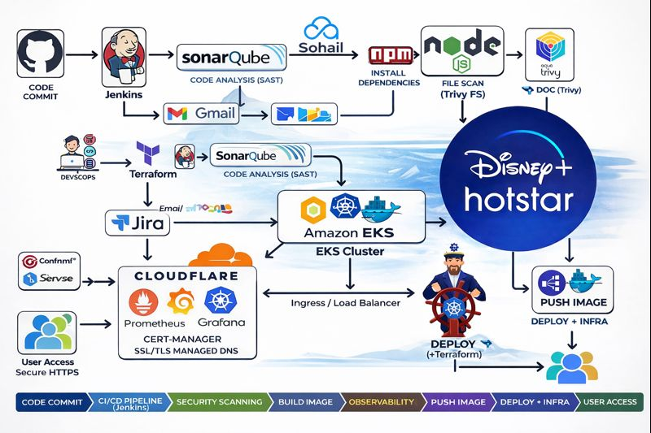

# Hotstar K8s Platform (Next.js) — DevSecOps CI/CD on Amazon EKS

Deploy a Hotstar-like **Next.js** application using an **end-to-end DevSecOps pipeline** on **Amazon EKS**, with **code quality gates**, **container + dependency vulnerability scanning**, and **production-grade observability** using **Prometheus & Grafana**.

---

## Architecture



---

## What this project demonstrates (Interview Highlights)

- **CI/CD with Jenkins**: build, test, scan, push, deploy
- **Code Quality Gate (SAST)** using **SonarQube**
- **Security Scanning**
  - **Trivy FS Scan** (dependency + repo scanning)
  - **Trivy Image Scan** (container vulnerability scanning)
- **Containerization** with Docker and versioned image tags
- **Kubernetes on Amazon EKS**
  - Deployments, Services, Ingress / Load Balancer
  - Namespaces + RBAC-ready structure
- **Observability**
  - Prometheus metrics scraping
  - Grafana dashboards + alerting ready
- **Infrastructure as Code** using Terraform (VPC + EKS)

---

## Tools & Services Used

| Category | Tools |
|---|---|
| Version Control | GitHub |
| CI/CD | Jenkins |
| Code Quality | SonarQube |
| Security | Trivy, OWASP principles |
| Containerization | Docker |
| Orchestration | Kubernetes (Amazon EKS) |
| Monitoring | Prometheus, Grafana |
| IaC | Terraform |
| DNS / Edge (optional) | Cloudflare (DNS + TLS/WAF) |

---

## CI/CD Pipeline Flow

1. **Checkout** source from GitHub
2. **Install dependencies** + build Next.js
3. **SonarQube analysis** → fail pipeline if Quality Gate fails
4. **Trivy FS scan** → fail pipeline for critical/high issues (configurable)
5. **Docker build** (versioned image tag)
6. **Trivy image scan**
7. **Push image** to registry (DockerHub/GHCR/ECR)
8. **Deploy to EKS** using kubectl/Helm
9. **Notify** via Email/Slack (optional)

---

## Project Stages

### Phase 1 — Docker
- Build image locally
- Run container locally
- Push image to registry

### Phase 2 — EKS + Monitoring + DevSecOps
- Provision EKS using Terraform
- Deploy application manifests/Helm chart
- Expose app via Ingress / LoadBalancer
- Monitor via Prometheus + Grafana
- Secure with Trivy + SonarQube quality gates

---

## Repository Structure (recommended)

```bash
.
├─ app/                     # Next.js application
├─ docker/                  # Dockerfile(s)
├─ k8s/                     # Kubernetes manifests (deploy, svc, ingress, hpa)
├─ helm/                    # Helm chart (optional)
├─ terraform/               # EKS + VPC infra (IaC)
├─ jenkins/                 # Jenkinsfile + pipeline scripts
└─ docs/
   └─ architecture.png
